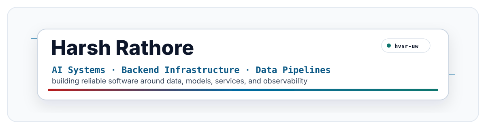

<!--
GitHub Profile README
Repo name: hvsr-uw
Header path: assets/header.svg
-->

  

<h1 align="center">Harsh Rathore</h1>

  <b>Computer Science student at UW-Madison.</b> 
  I build backend and infrastructure tools for AI and data systems.

  
  
  
  

---

### What I Build

I care about the engineering around intelligent systems. How data enters, how services validate it, how outputs are tested, and how failures become visible instead of hidden.

Project details live inside individual repositories. The pinned repos below show what I am currently building. 

You can also check out my previous GitHub account here: [Hvardhan2](https://github.com/Hvardhan2).

### Current Focus

| Area | Details |
| --- | --- |
| focus | AI systems, Neural Interface infrastructure, Autonomous Driving  data pipelines |
| Tools | Python, Java, C#, Rust, TypeScript, SQL, Docker, AWS |
| learning | Evaluation, Observability, cloud-native systems |

### Tooling

  

  

  <samp>build carefully &middot; test clearly &middot; debug honestly</samp>

